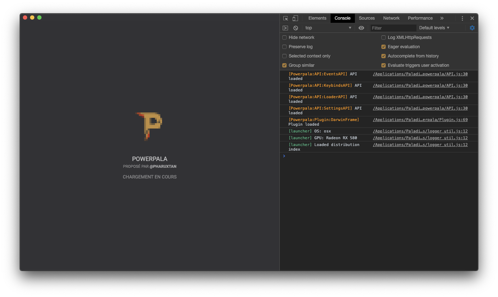

<h1 align="center">PowerPala</h1>

Un utilitaire qui permet de modifier le Paladium Launcher avec des plugins / themes facilement

## Installer PowerPala sur le Paladium Launcher

D'abord vous devez installer NodeJS si ce n'est pas déjà fait: https://nodejs.org/en/

Puis une fois installé [clonez](git://github.com/pharuxtan/powerpala.git) ou téléchargez le [master.zip](https://github.com/pharuxtan/powerpala/archive/master.zip) du git

Après ouvrez votre launcher, faites `Ctrl+Maj+I` sur Windows/Linux ou `⌘+Alt+I` sur MacOS, allez dans `console` puis mettez `shell.openItem(path.join(__dirname, "..", ".."));` et faite entrée pour ouvrir le dossier ou le app.asar se trouve

Puis déplacez le dossier `powerpala` ou `powerpala-master` (extrait du zip) dans le dossier ouvert et renommez le `app`

Ouvrez une invite de commande dans le dossier puis faites `npm install`

Puis (re)démarrez votre launcher

ET VOILA ! PowerPala est installé
